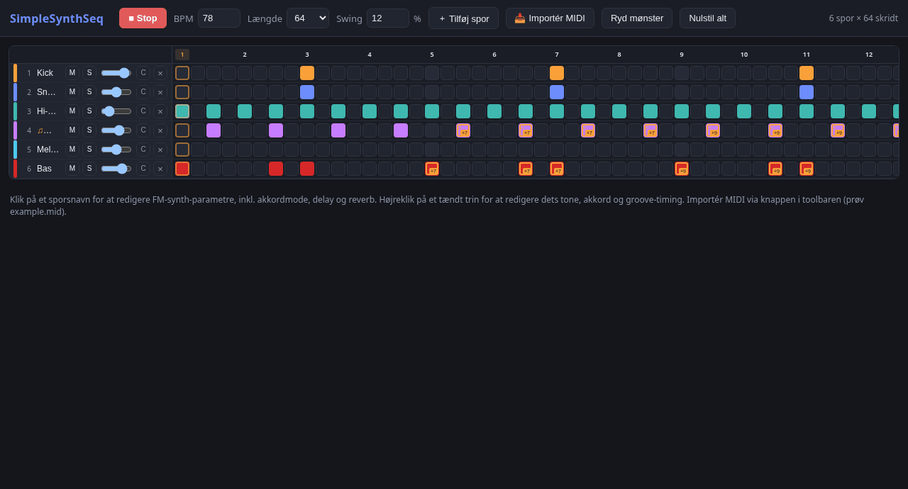

# SimpleSynthSeq

A small browser-based step sequencer with a built-in FM synth. The only dependency is [Bun](https://bun.sh) for serving the files; all audio is generated in the browser with the Web Audio API.



## Getting started

```bash
bun run dev
```

Then open <http://localhost:3000>. `dev` runs with hot reload, so edits to `app.js`, `style.css` and `index.html` show up immediately. Use `bun start` to run without hot reload. The port can be changed with the `PORT` environment variable.

## Features

- **Tracks and pattern:** Kick, snare, hi-hat, piano, melody and bass by default. Tracks can be added, removed and cleared, and the pattern length is selectable (16, 32 or 64 steps, or whatever a MIDI import needs).
- **FM synth per track:** Click a track name to edit carrier and modulator waveforms, mod ratio/index, pitch and amplitude envelopes, noise filter, panning and volume. Presets cover drums, piano, organ, guitar, strings, brass, pads and more.
- **Chord mode:** A track can play a chord on every lit step. Chord type, intervals, root note and octave are set in the panel, and individual steps can get their own note or chord via right-click.
- **Groove:** Global swing plus per-step micro-timing (nudge).
- **Effects:** Delay and algorithmic reverb as per-track sends.
- **MIDI import:** Load a Standard MIDI File from the toolbar. General MIDI programs and percussion are mapped to matching presets, and the whole file is imported (the pattern length grows as needed). Try the bundled `example.mid`.
- **Playback:** Space starts and stops. Click or drag the ruler to move the playback position. Mute and solo per track.

## Files

| File | Contents |
| --- | --- |
| `index.html` | Toolbar, sequencer grid and help text |
| `app.js` | Sequencer, FM synth, effects, MIDI parser and UI |
| `style.css` | Dark theme and layout |
| `server.js` | Bun server with HTML bundling and hot reload |
| `example.mid` | Small MIDI file for trying out the import |
